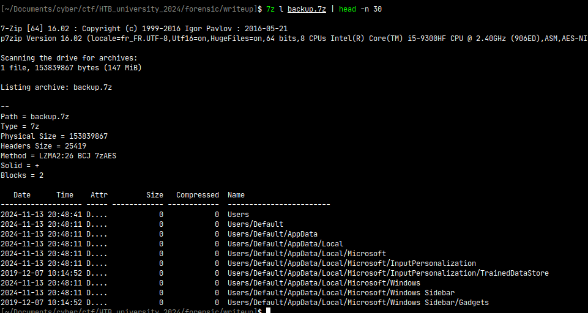
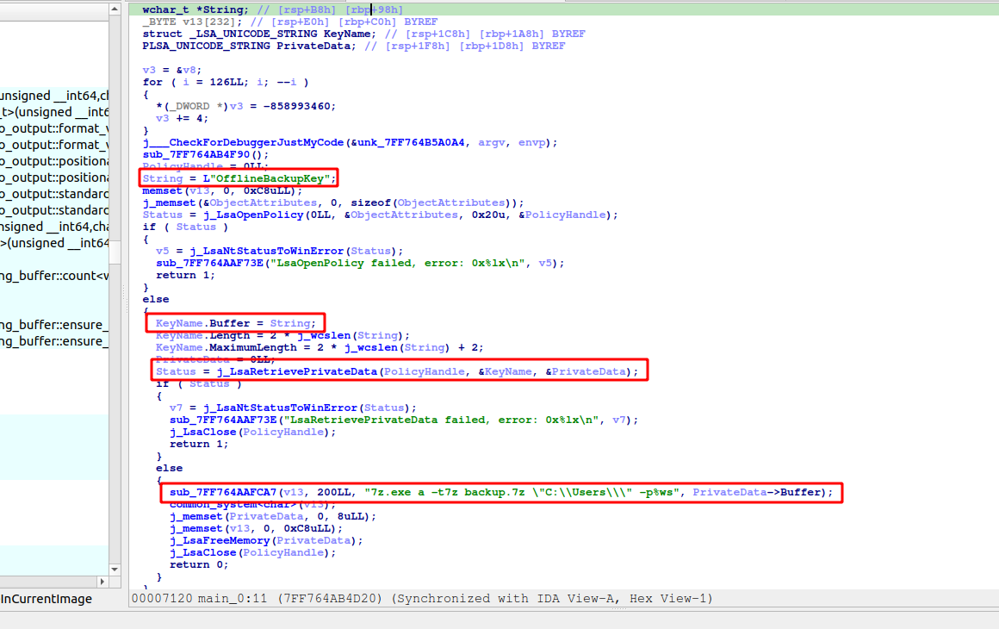
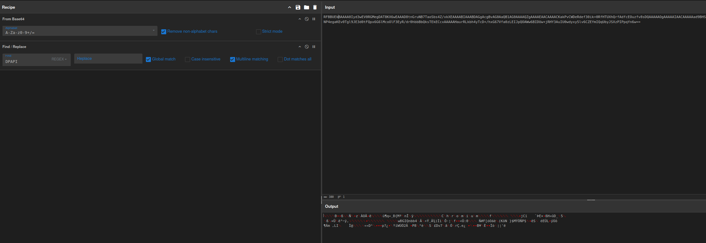
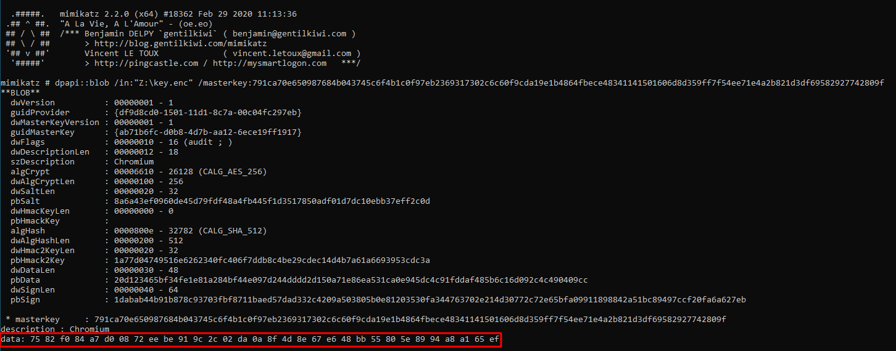
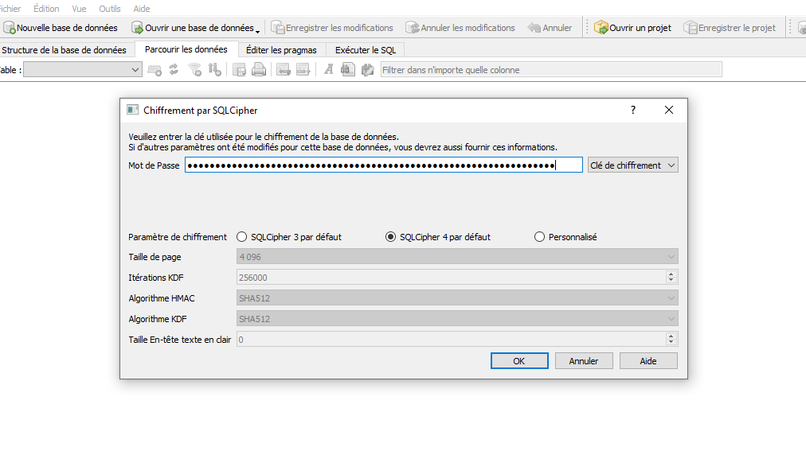
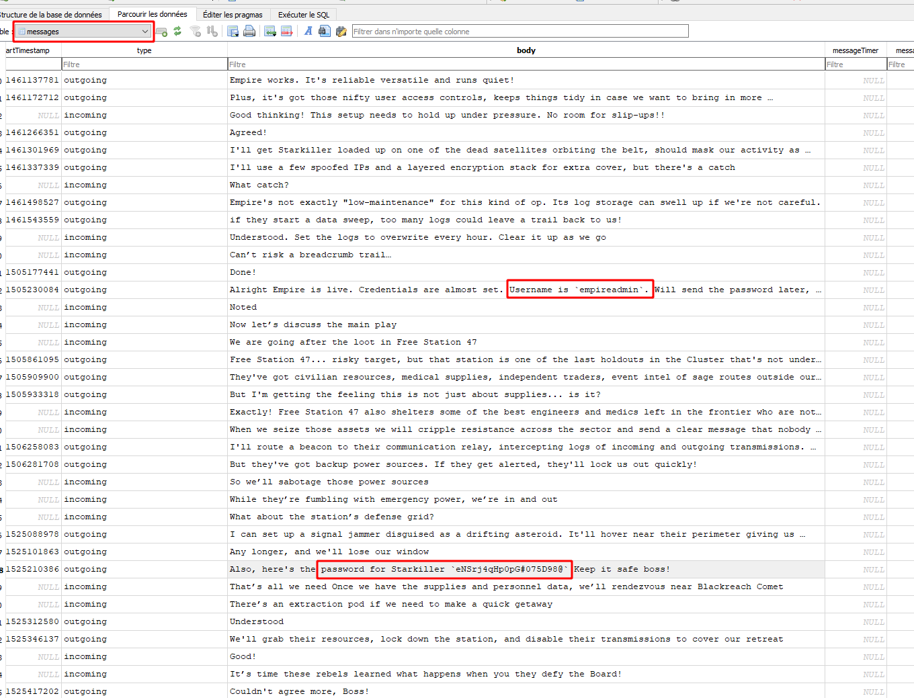

# signaling victorious

## Description

In a recent raid with your fellow bounty hunters you managed to recover a memory dump and a backup archive of the Frontier Board's Operation Center! The Board knows the Starry Spurr lies within your grasp and they are getting even more desperate... Uncover whatever secrets lie within the artefacts you are given and find a way to halt the Board's plans!! Note: Carefully read the `readme.txt` in the downloadables!

### readme.txt

- To access the Starkiller Web UI navigate to http://[DOCKER_IP]:[DOCKER_PORT]/index.html (notice the HTTP __not__ HTTPS)
- In the URL field in the UI change the URL to http://[DOCKER_IP]:[DOCKER_PORT]

- Note the difference between the two URLs, one is the UI, the other is the Web Socket Instance

### /index.html


La page index.html présente une interface de connexion au frontend Starkiller du C2 empire.


## Challenge

### backup.7z
Pour ce challenge nous avons en notre possession, un dump mémoire Windows 10 et une sauvegarde compréssée et chiffrée avec `7z`. En énumérant les fichiers contenus dans cette sauvegarde, on comprend que c'est un dossier `Users` d'un disque Windows.




Un premier objectif semble être de récupérer le contenu de cette sauvegarde.

### win10_memdump.elf

En analysant le dump mémoire avec `volatility3` (ou 2 avec le profil `Win10x64_19041`), la commande `pstree` ressort 2 applications intéressantes qui sont lancées via explorer.exe :

- **Signal** installée sur la machine et en utilisation lors du dump mémoire.

- **backuper.exe** en utilisation et ne semble pas connu après des recherches.


```sh
$ vol3.py -f ./win10_memdump.elf windows.pstree
[...]
** 748	4084	explorer.exe	0xb90b89a7c080	77	-	1	False	2024-11-13 00:54:22.000000 	N/A
*** 5984	748	VBoxTray.exe	0xb90b89e83340	15	-	1	False	2024-11-13 00:54:35.000000 	N/A
*** 5840	748	SecurityHealth	0xb90b8a269080	3	-	1	False	2024-11-13 00:54:35.000000 	N/A
*** 7056	748	powershell.exe	0xb90b8a9c4080	20	-	1	False	2024-11-13 00:55:29.000000 	N/A
**** 6808	7056	conhost.exe	0xb90b8a9ea340	8	-	1	False	2024-11-13 00:55:29.000000 	N/A
**** 7392	7056	backuper.exe	0xb90b8a69d2c0	4	-	1	False	2024-11-13 00:55:58.000000 	N/A
*** 7152	748	Signal.exe	0xb90b8a9da080	53	-	1	False	2024-11-13 00:54:38.000000 	N/A
```

On récupère l'exécutable backuper.exe :


### backuper.exe

On ouvre l'exécutable avec ida :



- La fonction `LsaRetrievePrivateData` est utilisée pour récupérer des données privées stockées dans Local Security Authority (LSA) secret store.
- `Keyname` est un pointeur vers une structure LSA_UNICODE_STRING qui contient le nom de la clé sous laquelle les données privées sont stockées, ici c'est `OfflineBackupKey`.
- Il créer une archive avec 7z et avec un mot de passe stockée dans LSA avec cette clé.

Volatility permet de récupérer le contenu de LSA avec `windows.lsa` pour `volatility3` ou `lsadump` pour `volatility2` :


Le mot de passe de la sauvegarde est donc : `yYj8g5Pk6h!-K3pBMSxF`.

### Signal.exe

En naviguant rapidement dans le dossier `Users` récupéré depuis la backup, Signal semble être une bonne piste. Le second objectif serait de récupérer le contenu des messages de l'application.

Les messages reçus et envoyés avec signal sont stockés localement sur la machine dans une base de données sqlite. Sur Windows, la base de données se situe dans

- `C:\Users\YourUserName\AppData\Roaming\Signal\sql\db.sqlite` 

et la clé pour déchiffrer la base de données : 

- `C:\Users\YourUserName\AppData\Signal\config.json`

Seulement après quelques tests, nous ne parvenons pas à récupérer le contenu de la db.

L'issue github : https://github.com/signalapp/Signal-Desktop/issues/7005 nous permet de comprendre qu'il y a eu un changement dans la protection de la clé pour déchiffrer la db. Selon une récente mise à jour de GitHub, l'entreprise a mis en œuvre la prise en charge de l'API Electron safeStorage afin d'améliorer la sécurité des clés de chiffrement des bases de données locale, et utilise la DPAPI pour protéger les clés de chiffrement.

> La DPAPI (Data Protection API) est un composant interne du système Windows. Il permet à diverses applications de stocker des données sensibles (par exemple des mots de passe). Les données sont stockées dans le répertoire des utilisateurs et sont sécurisées par des MasterKey spécifiques à l'utilisateur, dérivées du mot de passe de celui-ci. L'intérêt de l'utilisation de DPAPI est qu'en principe, les données ne peuvent être chiffrées et déchiffrées que par le même utilisateur (ou plutôt tout programme s'exécutant en tant qu'utilisateur), et uniquement sur le même ordinateur.


### Récupération de la clé

La clé de la base de données est en faite chiffrée avec une clé contenue dans `encrypted_key` du fichier `Local State` dans le répertoire Signal. La clé de chiffrement est à son tour chiffrée avec la MasterKey de la DPAPI Windows. 

Pour récupérer la MasterKey DPAPI, on peut utiliser le plugin `pypykatz` sur `volatility3` (à installer manuellement) ou on peut utiliser `memprocfs` qui permet de faire des minidumps pris en charge par pypykatz. Seulement il y'a des protections sur les dernières version de l'outil, on ne peut pas faire de minidump du processus : `lsass.exe`, on peut utiliser une version patché comme : https://github.com/0xNemo/MemProcFS_lsass

- Avec volatility : 

```sh
vol3d -f "`wvol win10_memdump.elf`" pypykatz
ERROR    pypykatz    : Failed to prcess TSPKG package! Reason: Page Fault at entry 0x0 in table page directory                                    
Volatility 3 Framework 2.12.0

credtype	domainname	username	NThash	LMHash	SHAHash	MasterKey	MasterKey(sha1)	key_guid	password

msv	DESKTOP-6MBJBAP	frontier-user-01	1d3e3e030ba1a179e1281406efd980bf		ded871d3a3992be2179840890d061c9f30a59a77				
dpapi						791ca70e650987684b043745c6f4b1c0f97eb2369317302c6c60f9cda19e1b4864fbece48341141501606d8d359ff7f54ee71e4a2b821d3df69582927742809f	8d53efa8456b9ba43206f4c3a6dc1c957d26105a	ab71b6fc-d0b8-4d7b-aa12-6ece19ff1917	
msv	DESKTOP-6MBJBAP	frontier-user-01	1d3e3e030ba1a179e1281406efd980bf		ded871d3a3992be2179840890d061c9f30a59a77
```

- Avec memprocfs patché : 


MasterKey : `791ca70e650987684b043745c6f4b1c0f97eb2369317302c6c60f9cda19e1b4864fbece48341141501606d8d359ff7f54ee71e4a2b821d3df69582927742809f`

Maintenant qu'on a la MasterKey, nous devons déchiffrer l'`encrypted_key` stockée dans `c:\Users\frontier-user-01\AppData\Roaming\Signal\Local State`. On récupère le blob qui est une string Base64 avec le préfixe `DPAPI` qu'on doit supprimer :




On enregistre la clé dans un fichier `key.enc`

L'outil `mimkatz` nous permet de récupérer la clé avec la MasterKey et le blob : 



decrypted key : `75 82 f0 84 a7 d0 08 72 ee be 91 9c 2c 02 da 0a 8f 4d 8e 67 e6 48 bb 55 80 5e 89 94 a8 a1 65 ef`

### Récupération des messages

Maintenant qu'on a récupéré la clé qui chiffre la clé de la db, nous devons récupérer la clé de db contenu dans `config.json`:

```sh
$ cat Users/frontier-user-01/AppData/Roaming/Signal/config.json 
{
  "encryptedKey": "763130cc1843cbf3949e872b373031e89c85f8e8d6e9ec3bd9340bb9c6fd844ca424d7e666feac3663f6c2810d6ddbdfb82f7faa4456eda119bacd2709fc2404eeeb74e69b2b3f2f71e765b74a068c5549a1871559d537de08a25c700a97cd"
}
```

Elle est chiffrée en AES GCM, un petit script python `decrypt.py` (merci à 0xItarow) :

```py
import os
import json
import base64
import sqlite3
from Crypto.Cipher import AES
import shutil

def generate_cipher(aes_key, iv):
    return AES.new(aes_key, AES.MODE_GCM, iv)
def decrypt_payload(cipher, payload):
    return cipher.decrypt(payload)

def decrypt_password(buff, master_key):
        iv = buff[3:15]
        payload = buff[15:]
        cipher = generate_cipher(master_key, iv)
        decrypted_pass = decrypt_payload(cipher, payload)
        decrypted_pass = decrypted_pass[:-16].decode()
        return decrypted_pass

a = decrypt_password(bytes.fromhex('763130cc1843cbf3949e872b373031e89c85f8e8d6e9ec3bd9340bb9c6fd844ca424d7e666feac3663f6c2810d6ddbdfb82f7faa4456eda119bacd2709fc2404eeeb74e69b2b3f2f71e765b74a068c5549a1871559d537de08a25c700a97cd'),b'\x75\x82\xf0\x84\xa7\xd0\x08\x72\xee\xbe\x91\x9c\x2c\x02\xda\x0a\x8f\x4d\x8e\x67\xe6\x48\xbb\x55\x80\x5e\x89\x94\xa8\xa1\x65\xef')

print(a)
```

```sh
$ python3 decrypt.py
65f77c5912a1456af299975228bb45857144ee8fb546683c9274e11a1617fa65
```

Vraie clé pour déchiffrer la base de données : `65f77c5912a1456af299975228bb45857144ee8fb546683c9274e11a1617fa65`

Il suffit d'ouvrir la base de données avec l'outil `DB Browser (SQLCipher)` :





Username : `empireadmin`
mot de passe du C2 : `eNSrj4qHp0pG#075D98@`


> Equipe ESNA, HTB University 2024. Big up à 0xItarow, Lamarr et taytendron qui ont carry


